# Metric Fetching Functions

The purpose of writing this documentation is to show the logic behind used Linux commands. Many of these metrics can be obtained in several ways. The methods used in this application have been selected based on several criteria:

- Availability from the level of a "clean" system based on GNU Linux,
- No need to wait for results to be calculated, e.g., we prefer to read metrics from the files,
- Instead of reading different information from 5 different places, we prefer to find a place from which we will be able to download most of these metrics and then possibly supplement them.

## List of paths and tools

Below is a list of paths from which we fetched data:

- `/proc/loadavg`
- `/proc/cpuinfo`
- `/proc/stat`
- `/proc/<gPROCESSID>/io`
- `/proc/meminfo`
- `/proc/net/dev`

And list of tools/commands:

- date
- vmstat
- ps
- iostat
- sar
- ifstat
- powerstat
- cut, grep, cat, awk, tail

## System Metrics

### Interrupt and Context Switch Rates

```bash
vmstat
```

As far as we know, the output of the `vmstat` command has fixed places in which the metric data is entered (i.e. there is no shift if a given metric at some point takes 1,2,3 places more than before). For this reason, we could specify fixed places from which we read the interrupt rate and context switch rate.

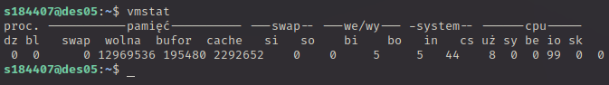

### Number of All and Running Processes

```bash
cat /proc/loadavg | cut -d ' ' -f 4
```

From the file `/proc/loadavg` we only get the number of all processes and processes that are currently running. This number is separated by a slash (`/`).

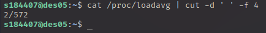

### Number of Blocked Processes

```bash
ps -eo state | grep -c '^D'
```

Blocked processes are not available using previous methods so we had to use another command to get this number. This is a possibility of improvement in the future.

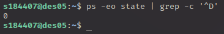

## Processor Metrics

### Number of Processors

```bash
cat /proc/cpuinfo | grep 'processor' -c
```

Getting the number of processors that were reported to the `/proc/cpuinfo`. We can base our algorithm on that and read specific information about each processor.

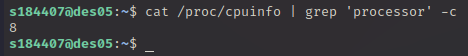

### User, Nice, System, Idle, [...] Times

```bash
cat /proc/stat
```

This file gives us a lot of information about all of the processors. We are only interested in the first line of the output which provides sum of information from all processors reported to the `/proc/cpuinfo`.

All of the times are measured in `USER_HZ` which is typically 1/100 of a second.

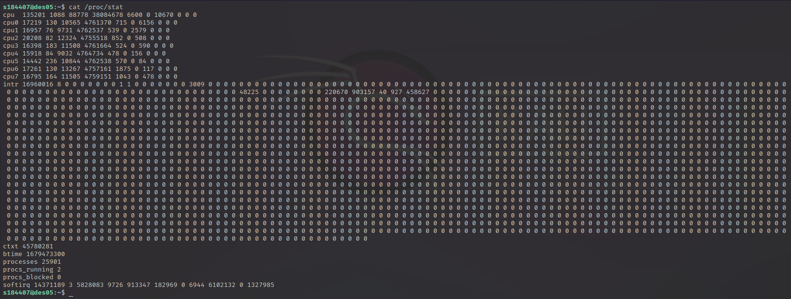

### L2 and L3 Cache Hit and Miss Rates

```bash
perf stat -e cpu/event=0x24,umask=0x01,name=L2_RQSTS_DEMAND_DATA_RD_HIT/,cpu/event=0x24,umask=0x02,name=L2_RQSTS_ALL_DEMAND_DATA_RD/,cpu/event=0x24,umask=0x04,name=L2_RQSTS_DEMAND_DATA_RD_MISS/,cpu/event=0x2e,umask=0x01,name=LLC_REFERENCES_LLC_HIT/,cpu/event=0x2e,umask=0x02,name=LLC_REFERENCES_LLC_MISS/,cpu/event=0x2e,umask=0x08,name=LLC_REFERENCES_SNOOP_STALL/ --all-cpus sleep 1 2>&1 | awk '/L2_RQSTS_ALL_DEMAND_DATA_RD|L2_RQSTS_DEMAND_DATA_RD_HIT|L2_RQSTS_DEMAND_DATA_RD_MISS|LLC_REFERENCES_LLC_HIT|LLC_REFERENCES_LLC_MISS|LLC_REFERENCES_SNOOP_STALL/ {print $1}'
```

This one-liner should give the following L2 and L3 cache metrics: 

- `L2_RQSTS_DEMAND_DATA_RD_HIT`: counts L2 cache hits for demand data reads
- `L2_RQSTS_ALL_DEMAND_DATA_RD`: counts all demand data reads to L2 cache
- `L2_RQSTS_DEMAND_DATA_RD_MISS`: counts L2 cache misses for demand data reads
- `LLC_REFERENCES_LLC_HIT`: counts LLC cache hits
- `LLC_REFERENCES_LLC_MISS`: counts LLC cache misses
- `LLC_REFERENCES_SNOOP_STALL`: counts snoop stalls on the bus due to LLC reference requests

From these metrics, you can **calculate** the cache L2 hit rate, cache L2 miss rate, cache L3 hit rate, cache L3 miss rate, and cache L3 hit snoop rate **using the following formulas**:

**Cache L2 hit rate** =  L2_RQSTS_DEMAND_DATA_RD_HIT / L2_RQSTS_ALL_DEMAND_DATA_RD

**Cache L2 miss rate** = L2_RQSTS_DEMAND_DATA_RD_MISS / L2_RQSTS_ALL_DEMAND_DATA_RD

**Cache L3 hit rate** = LLC_REFERENCES_LLC_HIT / (LLC_REFERENCES_LLC_HIT + LLC_REFERENCES_LLC_MISS)

**Cache L3 miss rate** = LLC_REFERENCES_LLC_MISS / (LLC_REFERENCES_LLC_HIT + LLC_REFERENCES_LLC_MISS)

**Cache L3 hit snoop rate** = LLC_REFERENCES_LLC_HIT / (LLC_REFERENCES_LLC_HIT + LLC_REFERENCES_SNOOP_STALL)

*Note that these formulas assume that the events provided in the perf stat command accurately measure the cache behavior of your system. However, depending on the specific hardware and software configuration, the event names or formulas may need to be adjusted.*

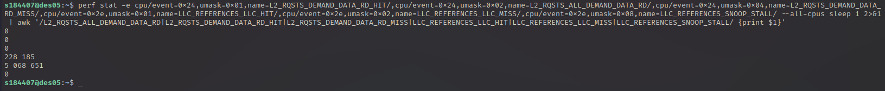

### Cycles Rates and Relative Frequencies

```bash
perf stat -e instructions,cycles,cpu-clock,cpu-clock:u sleep 1 2>&1 | awk '/^[ ]*[0-9]/{print $1}'
```

- `Number of instructions retired`: This is the total number of instructions executed by the processor during the sampling period.

- `Cycles`: This is the total number of cycles executed by the processor during the sampling period.

- `CPU clock`: This is the CPU clock frequency in MHz during the sampling period.

- `CPU clock:u`: This is the unhalted CPU clock frequency in MHz during the sampling period.

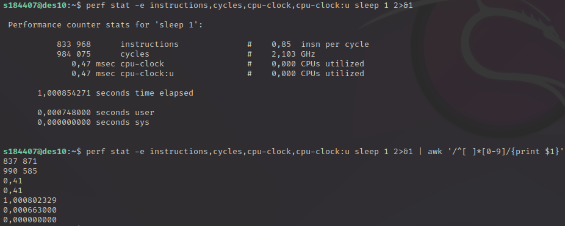

## Input / Output Metrics

### Data read and written, Read and Write Operations Rates

```bash
sudo awk '{ print $2 }' /proc/1/io
```

Basically this command outputs second column of the `/proc/1/io file`. The `1` in the filepath is the Process ID (it is defined globally as `GPROCESSID`). 

The first and second rows are respectively all characters read and written by the specified process divided by 1024 to get this number in MB. Right now this command doesn't count write and read "operations rate". It just outputs the number of read and write operations for this specific process ID.

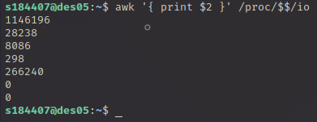

### Read, Write, Flush operations and Flush time

```bash
iostat -d -k | awk '/^[^ ]/ {device=$1} $1 ~ /sda/ {print 1000*$10/($4*$3), 1000*$11/($4*$3), $6/$4, $7/$6}'

/^[^ ]/ {device=$1}              # If the line starts with a non-space character, set the variable "device" to the first field
$1 ~ /sda/ {                     # If the first field contains "sda"
    print 1000*$10/($4*$3),      # Print the read time in milliseconds (Field 10 * 1000 / (Field 4 * Field 3))
          1000*$11/($4*$3),      # Print the write time in milliseconds (Field 11 * 1000 / (Field 4 * Field 3))
          $6/$4,                 # Print the flush operations per second (Field 6 / Field 4)
          $7/$6                  # Print the flush time per flush operation in milliseconds (Field 7 / Field 6)
}
```

This command will first run `iostat -d -k` to get the disk statistics, then use `awk` to parse the output. The awk script looks for lines that start with a non-space character (which indicates the start of a new device's statistics) and saves the device name to the device variable. It then looks for lines that contain the string sda (*which can be replaced with any other device name as needed*) and calculates all of the metrics.

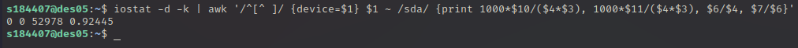

## Memory Metrics

### Active, Inactive, Cached, and Used Memory and Swap

```bash
grep -v -e 'anon' -e 'file' /proc/meminfo | grep -E '^(Cached|SwapCached|SwapTotal|SwapFree|Active|Inactive)' | awk '{print $2}'
```

All of the information we can get from the `/proc/meminfo` file. All of the metrics are saved in kB but, for the sake of the output, we are dividing it by 1024 to have MB.

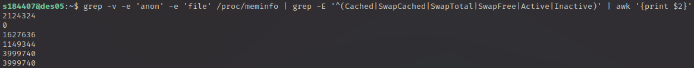

### Page In, Out, Fault, Free, Activate and Deactivate Rates

```bash
sar -r -B 1 1 | awk 'NR==4{print $2,$3,$4,$5,$6,$7,$8}'
```

This command uses the `-r` and `-B` options to collect memory page and paging statistics, and then selects the relevant fields using `awk`. All of the statistics for pages are measured in pages/second.

The `pgscank/s` column shows the rate of kernel page scans in kilopages per second, and the `pgscand/s` column shows the rate of direct reclaim attempts in kilopages per second.

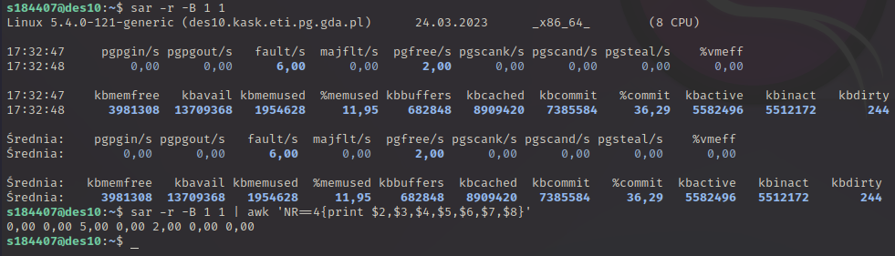

### Memory Read, Write, and I/O Rates

```bash
sar -b 1 1 | awk 'NR==4{print $6/1024,$7/1024,($6+$7)/1024}'
```

This command selects the fourth line of the `sar -b` output, which contains the memory read and write rates in kilobytes per second. The awk command then divides these rates by 1024 to convert them to megabytes per second, and prints the results with descriptive labels. Finally, it calculates the total memory I/O rate by summing the memory read and write rates, and also converts the result to MB/s.

Note that the output of this command may vary depending on your Linux distribution and version, so you may need to adjust the awk commands accordingly to extract the desired metrics.

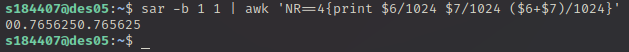

## Network Metrics

### Receive and Send Packet Rates

```bash
ifstat 1 1 | tail -1 | awk '{ print $1, $2 }'
```

Unfortunately, I haven't been able to find a place from which I could download information about the current receive and send packet rate that would not require a 1 second delay from me to measure it.

Both metrics are measured in KB/s.

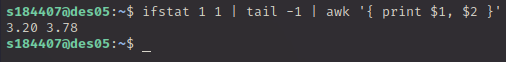

### Sent and Received Data

```bash
cat /proc/net/dev | awk '/^ *eth0:/ {rx=$3; tx=$11; print rx,tx; exit}'
```

The file `/proc/net/dev` keeps track of all received and sent packets and bytes. Right now we are outputting number of packets but it's possible to change the command and output number of bytes.

**There might be a need to change `eth0` to appropriate name of the network interface.**

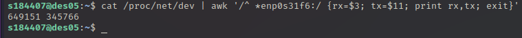

## Power Metrics

### Memory Power

```bash
sudo powerstat -d 1 -s cpu,panel
```

powerstat needs to be run with root privilege when using `-g`, `-p`, `-r`, `-s` options.


### Using RAPL

```bash
[TODO]
```


### Using NVML

```bash
[TODO]
```

